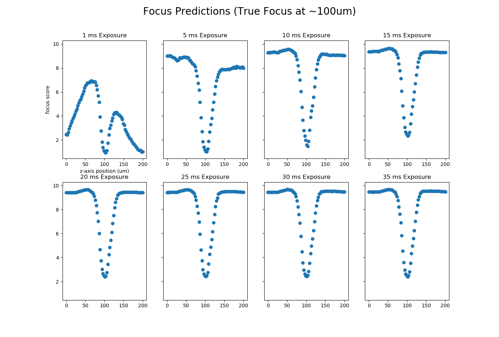
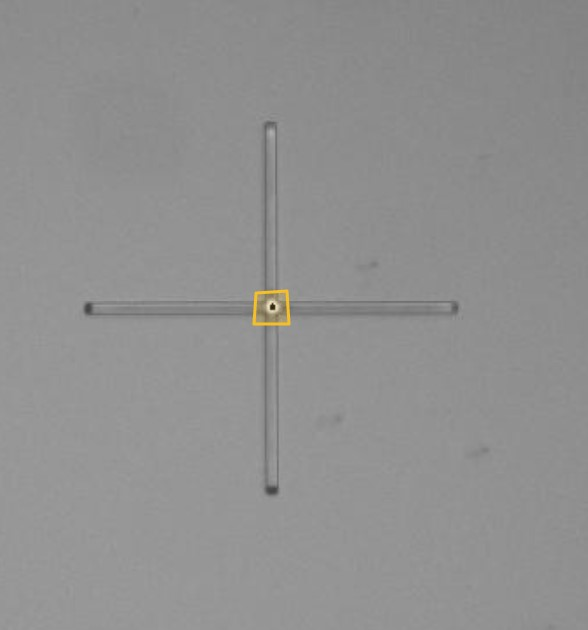

# SmartScope Documentation

## Table of Contents

- [GUI](#User-Interface)
  - [How to Open](#How-to-Open)
  - [Parameters](#Parameters)
    - [Experiment](#Experiments)
    - [Exposure](#Exposure)
    - [Focus](#Focus)
    - [Saving](#Saving)
    - [General](#General)
    - [Calibration](#Calibration)
  - [Saving and Loading](#Saving-and-Loading)
- [System Calibration](#System-Calibration)
- [Adding Parameters](#Adding-Parameters)
- [Changing Camera](#Changing-Camera)
- [Training Models](#Training-Models)
  - [Alignment Model](#Alignment-Model)
  - [Focus Model](#Focus-Model)


## User Interface

### How to Open

During installation, a SmartScope.bat file will be generated in the Desktop folder of the current user. This can be clicked on to run the SmartScope application.

## Parameters

### Experiment

| Parameter     | Description   | Function |
| ------------- | ------------- | -------- |
| Chip          | The type of chip to be imaged. Included chips are ML and KL style chips. To add a new chip, see the steps in [Adding Parameters](#Adding-Parameters).| Controls where the scope looks for alignment marks, focuses, and images. |
| Cycle Number | The number of cycles used in manufacturing the current chip. | None |
| Drug | Drug used on cells. | Used in file path. |
| Cell | Type of cell on chip. | None |
| Origin | Origin of cells.  | None |
| Start Date | Date at the beginning of the experiment. | Used in file path. |
| Concentration | Concentration of drug used on cells. If Control leave blank. |  Used in file path. |
| Chip Index | Number to identify chip. | Used in file path. |

### Exposure

| Parameter     | Description   | Function |
| ------------- | ------------- | -------- |
| Name of Channel | Exposure time for the particular channel specified in led_intensities.yml | When checked, channel and exposure settings will be imaged. If more than one channel is selected, the scope will image multiple times using the same focus and alignment values. |

### Focus

| Parameter        | Function |
| ------------- | -------- |
| Step Size (um) | Distance moved in the z-direction at each interval. |
| Initial Focus Range (um) | Total distance moved in the z-direction across all intervals to find focal plane of first point. |
| Focus Range (um) | Total distance moved in the z-direction across all intervals to find focal plane of all focus points following the first point. |
| Focus Points X | Number of points in the x direction for focal adjustment. Must be greater than 3 for interpolation function to work. |
| Focus Points Y | Number of points in the y direction for focal adjustment. Must be greater than 3 for interpolation function to work. |
| Focus Exposure | The camera exposure to use for focusing. This value can be calibrated following the [Focus Exposure Calibration](#Focus-Exposure-Calibration) instructions. |

### Saving

| Parameter    | Function |
| -------------| -------- |
|Folder| The head of the saving path |
|Output Image Pixel Width| The size of the saved image output |
|Output Image Pixel Height| The size of the saved image output |

### General

| Parameter     | Description   | Function |
| ------------- | ------------- | -------- |
| Alignment Model Name | Alignment Mask-RCNN model file. |
| Focus Model | Focus model file |
| Objective | The magnification used for imaging. | None |
| Apartment per Image | Number of apartments to be captured in a single image | Determines image center. |
| Image Rotation (degrees) | Rotation of the captured images. | This can be adjusted if images are not saved in the proper orientation. |

### Calibration

| Parameter     | Description   | Function |
| ------------- | ------------- | -------- |
| Stage to Pixel Ratio | This is the ratio that coverts between pixels and microns | This ratio is needed for determining the stage position of the center of an alignment mark. |
| Calibrated First Position | XY distance from the center of the first alignment mark to the center of the first apartment. | This is used to calculate the positions for all of the images. |

## Saving and Loading


## System Calibration

The system must be calibrated every time a new objective or a new chip is used.

1. The Stage to Pixel Ratio must be calibrated before the First Position. Click the Calibrate Stage/Pixel Ratio button, then follow the instruction in the pop-up.

    

2. Once you have a value for the Ratio, you can click the Calibrate First Position button. Frist align the alignment mark nearest the (0,0) apartment with the cross. Then, align the box with the (0,0) apartment.

    

## Adding Parameters

To add new parameters and values for imaging, simply add to the   yaml files in following the formats:

### Chips - experiment_config.yml

```yaml
chips:
 - name: "Name to Identify Chip"
   number_of_apartments: number of apartments in the y direction
   number_of_streets: number of apartments in the x direction
   apartment_spacing: length of one apartment in the y direction
   street_spacing: length of one apartment in the x direction
   chip_width: total distance alignment marks in the x direction
   chip_height: total distance alignment marks in the y direction
```

### Drugs, Cells, Origins - experiment_config.yml

```yaml
drugs:
 - name of drug
cells:
 - name of cell type
origins:
 - origins of cells
```

### Lighing and shutters - led_intensities.yml

```yaml
Channel name:
  - shutter: number representing the turret position (defined in mmc cfg file)
    LED name 1: intensity (0-100)
    LED name 2: intensity (0-100)
    LED name 3: intensity (0-100)
    LED name 4: intensity (0-100)
```

For these changes to take effect the application must be restarted.

## Changing Camera

All of the camera functions are located in the 'smartscope/source/sc_utils.py' file. To change the camera used for imaging, replace the following lines at the top of the file to import your camera's python package. Then, the functions start_cam(), close_cam(), get_frame_size(), get_frame(), and get_live_frame() must be adjusted to work with the new camera.

```python
# Change these lines to import different camera package
# -----------------------------------------------------
from pyvcam import pvc
from pyvcam.camera import Camera

def start_cam():
    ''' Initializes the PVCAM

    returns: cam instance
    '''
    try:
        # YOUR CODE HERE
    except:
        raise RuntimeError('Could not start Camera')
    return cam

def close_cam(cam):
    ''' Closes the PVCAM instance
    args:
        - cam: camera instance
    '''
    # YOUR CODE HERE

def get_frame_size():
    '''
    returns a tuple (<image pixel width>, <image pixel height>)
    '''
    cam = start_cam()
    shape = cam.shape # YOUR CODE HERE
    close_cam(cam)
    return shape

def get_frame(exposure):
    ''' Gets a frame from the camera '''
    cam = start_cam()
    frame = cam.get_frame(exp_time=exposure) # YOUR CODE HERE
    close_cam(cam)
    return frame

def get_live_frame(cam, exposure):
    ''' Gets a frame from the passed camera instance. This is a faster
    way to get consecutive frames from a camera, used for focus and
    imaging.

    args:
        - cam: camera instance
        - exposure: exposure time

    '''
    return cam.get_frame(exp_time=exposure) # YOUR CODE HERE

# -----------------------------------------------------
```

## Changing LED and Shutter Control

To change the LED and shutter control, the change_shutter() and change_LED_value() functions in smartscope/source/sc_utils.py must be adjusted.

```python
# AUTO CONTROL FUNCTIONS
def change_shutter(controller, value):
    # Set shutter to 'value' here

def change_LED_values(controller, LED, value):
    # Set 'LED' to 'value' here
```

Alternatively, this can be manually done by setting these functions to:

```python
def change_shutter(controller, value):
    input ('Change shutter to: '+ value + ' then press Enter')

def change_LED_values(controller, LED, value):
    input ('Change LED values to match: LED: ' + LED + ' value: '+ value + ' then press Enter')
```

## Focus Exposure Calibration

To find the best focus exposure time for a particular system, open an Anaconda Prompt and run:

```bash
conda activate smartscope
cd path\to\smartscope\directory
cd smartscope\tests
python focus_exposure_testing.py
```

Follow the instructions to enter the desired exposures to test. This will take a few minutes to run, then it will open a plot of the focus scores at different z heights at 8 different exposure times. For example:



What we are looking for is a sharp minimum point that is as close to zero as possible at the desired focus. In the plots above, an exposure of between 5 and 10 ms will produce the optimum results. Be sure to transfer the best value to the the Focus Exposure Parameter in the SmartScope application.

## Training Models

### Alignment Model

To train a new model on an alignment mark dataset, take the following steps:

1. Generate images using the smartscope/notebook/data_generation/alignment_training_data_capture.ipynb file. This can be run by opening an Anaconda prompt and entering the following:

    ```bash
    conda activate smartscope
    cd path/to/SmartScope
    cd smartscope/notebook/data_generation
    jupyter lab
    ```

    This will open jupyter lab in a browser, open the alignment_training_data_capture.ipynb file.

2. Follow the instructions in the jupyter notebook to generate images of alignment marks. For the best results, the lighting or exposure and focus should be varied between images. A minimum of ~50 images should be taken, but more is better.

3. Use [LabelBox](https://labelbox.com/) to create labels for all of the images generated. The original alignment_model was labeled by making a box around the center of the alignment mark. For Example:

    

    It does not matter what the label of the alignment mark looks like, but the center of the label must be the center of the alignment mark and they must be consistent.

4. Download the labels from the "Export" tab in Labelbox using the JSON and XY formatting.

5. Run the following commands to open the jupyter notebook for training:

    ```bash
    conda activate smartscope
    cd path/to/SmartScope
    cd smartscope/notebook/training
    jupyter lab
    ```

    Then open the alignment_traing.ipynb file.

6. Make sure that the path to the Labelbox json file, and the image dataset folder are correct in the first cell of the notebook.

7. Run the cells to train the new model.

### Focus Model

The focus model used in this repo is based on [Google's Microscope Image Focus Quality Classifier](https://github.com/google/microscopeimagequality), follow the instructions in the README on their github page to train a new model.

NOTE: The original microscopeimagequality repo must be used with python 2.


